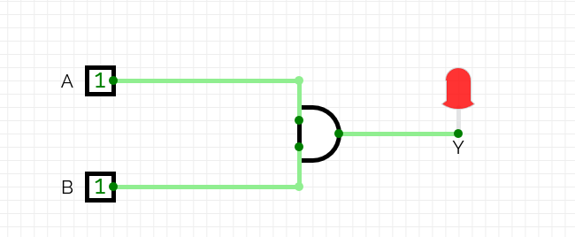

# 🔧 Chapter 1: Build Your First Digital Circuits
## শুরু করো - তোমার প্রথম Logic Circuit বানাও!

> **"Every processor starts with a single gate. Let's build yours!"**
> **"প্রতিটি processor শুরু হয় একটি gate দিয়ে। চলো তোমারটা বানাই!"**

---

## 🎯 এই Chapter এ তুমি বানাবে:

```
Week 1 Goals:
□ Day 1: AND, OR, NOT gates (CircuitVerse)
□ Day 2: NAND, NOR gates
□ Day 3: XOR, XNOR gates  
□ Day 4: Half Adder
□ Day 5: Full Adder
□ Day 6: 4-bit Adder
□ Day 7: Share your builds! #BuildYourOwnProcessor
```

**Time:** 1 week (3-4h/day)  
**Tools:** Browser only! (CircuitVerse.org)  
**Cost:** ₹0 (Free!)

---

## 🚀 QUICK WIN - 5 মিনিটে তোমার প্রথম Circuit!

### এখনই করো (Reading থামাও, BUILD করো!):

**Step 1:** যাও → https://circuitverse.org  
**Step 2:** Click "Launch Simulator"  
**Step 3:** বানাও তোমার প্রথম AND gate:

```
Components (Left panel):
1. Drag "Input" (2টা) → Name them A, B
2. Drag "AND gate" (1টা)
3. Drag "Output" LED (1টা) → Name it Y
4. Wire them: A → AND input 1
               B → AND input 2
               AND output → Y
```

**Step 4:** Test করো (Click switches!):
```
A=OFF, B=OFF → LED OFF ✓
A=OFF, B=ON  → LED OFF ✓
A=ON,  B=OFF → LED OFF ✓
A=ON,  B=ON  → LED ON! ✓✓✓
```

🎉 **BOOM! তুমি তোমার প্রথম digital circuit বানিয়ে ফেলেছো!**

**তোমার circuit এরকম দেখতে হবে:**



এখন পড়তে থাকো - তুমি ইতিমধ্যে একজন circuit builder! 💪

---

## ১.১ ডিজিটাল কেন? কারণ তুমি Processor বানাবে!

### তুমি কী বানাতে চাও?

**Option 1: Analog Circuit (পুরনো পদ্ধতি)**
```
Problems:
❌ Noise problem: একটু interference = সব망
❌ Exact value impossible: 3.7V না 3.8V?
❌ Copy করলে quality loss
❌ Complex circuitry
❌ Non-programmable
❌ Power hungry

Example: Old radio, cassette player (মনে আছে?)
```

**Option 2: Digital Circuit (তুমি এটা বানাবে!)**
```
Advantages:
✅ Noise resistant: Threshold পর্যন্ত OK
✅ Exact values: শুধু 0 অথবা 1
✅ Perfect copies: Infinite times!
✅ Simple circuits: Just ON/OFF
✅ Programmable: Software control
✅ Low power: Modern chips

Example: Smartphone, laptop, তোমার processor!
```

### Physical Implementation - কিভাবে কাজ করে?

```
Real Circuit (তোমার FPGA তেও এমন):

Voltage Levels:
5V  ──┐       ┌───┐       ┌─────  Logic 1 (HIGH)
      │       │   │       │
      │       │   │       │       Threshold: ~2.5V
      │       │   │       │       (Noise margin)
      │       │   │       │
0V  ──┴───────┘   └───────┘─────  Logic 0 (LOW)

Transistor (Building block):
       ┌──── Output (0 or 1)
       │
    ───┤
       │ ← Gate (Control signal)
    ───┤
       │
      GND

Gate ON  → Current flows → Output = 1
Gate OFF → No current    → Output = 0

1 transistor = 1 bit storage
1 billion transistors = 1 modern CPU!
```

---

## ১.২ Binary - তোমার Processor এর ভাষা

### কেন Binary? কারণ Transistor!

```
Physical Reality:

1 Transistor = 1 Switch
Switch has 2 states: ON or OFF

Why not 3 states? 4 states?
→ Unreliable! Noise problem!
→ Binary is optimal!

Example:
2-state (Binary):  100% reliable ✅
3-state (Ternary): 60% reliable ❌
4-state (Quad):    30% reliable ❌❌

Your processor uses 5+ billion transistors!
All binary! All reliable!
```

### Bit Power - Build to Understand

**Build This in CircuitVerse:**

```
Project: LED Binary Counter
Components:
- 1 Clock (Input, 1 Hz)
- 4 T-Flip-flops (chained)
- 4 LEDs (outputs)

Result: Count 0000 → 1111 in binary!
Watch binary in action!

Connection:
Clock → TFF0 → TFF1 → TFF2 → TFF3
         ↓      ↓      ↓      ↓
        LED0   LED1   LED2   LED3
```

**What You'll See:**
```
Count | LED3 LED2 LED1 LED0 | Decimal
------|---------------------|--------
0000  |  OFF OFF OFF OFF    |   0
0001  |  OFF OFF OFF ON     |   1
0010  |  OFF OFF ON  OFF    |   2
0011  |  OFF OFF ON  ON     |   3
...   |  ...                |  ...
1111  |  ON  ON  ON  ON     |  15
```

🎉 **তুমি binary counter বানিয়ে ফেলেছো! This is in your CPU!**

### Binary Math - Build a Calculator

**Multiple Bits = More Numbers:**
```
1 bit:  2¹  = 2 values    (0-1)
2 bits: 2²  = 4 values    (0-3)
3 bits: 2³  = 8 values    (0-7)
4 bits: 2⁴  = 16 values   (0-15)
8 bits: 2⁸  = 256 values  (0-255) ← 1 byte!
16 bits: 2¹⁶ = 65,536     (0-65535)
32 bits: 2³² = 4+ billion ← Your CPU!

Formula: n bits → 2ⁿ values (0 to 2ⁿ-1)
```

---

## ১.৩ Logic Gates - তোমার CPU এর Building Blocks

এই 7টা gates দিয়েই তুমি processor বানাবে!

### 🔨 Gate 1: AND - "Both Must Be ON"

**Real-World Example:**
```
Car starting system:
- Key inserted? (Input A)
- Brake pressed? (Input B)
→ Engine starts? (Output Y)

Both needed! That's AND!
```

**Build It NOW:**
```
CircuitVerse Steps:
1. Add 2 Input switches (A, B)
2. Add 1 AND gate
3. Add 1 Output LED (Y)
4. Connect: A → AND pin 1
            B → AND pin 2
            AND out → Y
5. TEST all 4 combinations!
```

**Truth Table (তুমি verify করবে):**
```
┌───────┬───────┬─────────┬──────────────┐
│   A   │   B   │    Y    │  LED Glows?  │
├───────┼───────┼─────────┼──────────────┤
│  OFF  │  OFF  │    0    │      NO      │
│  OFF  │  ON   │    0    │      NO      │
│  ON   │  OFF  │    0    │      NO      │
│  ON   │  ON   │    1    │     YES! ✓   │ ← Only this!
└───────┴───────┴─────────┴──────────────┘
```

**Boolean Expression:**
```
Y = A · B  (also written as A AND B, or AB)

Circuit Symbol:
    A ──┐
        ├──[&]─── Y = A·B
    B ──┘
```

**Where in CPU?**
```
AND gates used in:
✓ Address decoding
✓ Enable signals
✓ Condition checking
✓ ALU operations
```

---

### 🔨 Gate 2: OR - "Any One Can Turn ON"

**Real-World Example:**
```
Emergency alarm:
- Fire sensor? (Input A)
- Smoke sensor? (Input B)
→ Ring alarm? (Output Y)

Either one triggers! That's OR!
```

**Build It:**
```
Same as AND, but use OR gate
Test: ANY input ON → LED ON!
```

**Truth Table:**
```
┌───────┬───────┬─────────┬──────────────┐
│   A   │   B   │    Y    │  LED Glows?  │
├───────┼───────┼─────────┼──────────────┤
│  OFF  │  OFF  │    0    │      NO      │ ← Only this OFF
│  OFF  │  ON   │    1    │     YES!     │
│  ON   │  OFF  │    1    │     YES!     │
│  ON   │  ON   │    1    │     YES!     │
└───────┴───────┴─────────┴──────────────┘
```

**Boolean Expression:**
```
Y = A + B  (also: A OR B)

Circuit Symbol:
    A ──┐
        ├──[≥1]─── Y = A+B
    B ──┘
```

---

### 🔨 Gate 3: NOT - "Flip It!"

**Real-World Example:**
```
Safety interlock:
- Door closed? (Input A)
→ Machine runs? (Output Y)

Door OPEN → Machine STOPS
Door CLOSED → Machine RUNS

Opposite! That's NOT!
```

**Build It:**
```
Components:
- 1 Input switch (A)
- 1 NOT gate (Inverter)
- 1 Output LED (Y)

Magic: Switch OFF → LED ON!
       Switch ON  → LED OFF!
```

**Truth Table:**
```
┌───────┬─────────┬──────────────────┐
│   A   │    Y    │   What Happens   │
├───────┼─────────┼──────────────────┤
│  OFF  │   ON    │  Switch OFF → LED ON!  │
│  ON   │   OFF   │  Switch ON → LED OFF!  │
└───────┴─────────┴──────────────────┘
```

**Boolean Expression:**
```
Y = A'  (also: Ā, NOT A, ~A)

Circuit Symbol:
    A ──[⊐o]─── Y = A'
    (bubble = inversion)
```

---

### 🔨 Gate 4: NAND - "Universal Gate!"

**Why Special?**
```
NAND = AND + NOT
But here's the magic:
→ You can build ALL gates using ONLY NAND!
→ That's why it's "Universal"!
→ Your CPU has millions of NAND gates!
```

**Build It:**
```
Method 1: AND → NOT → NAND
Method 2: Use NAND gate directly

Test: Opposite of AND!
```

**Truth Table:**
```
┌───┬───┬───┬────────────┐
│ A │ B │ Y │ Reasoning  │
├───┼───┼───┼────────────┤
│ 0 │ 0 │ 1 │ NOT(0·0)=1 │
│ 0 │ 1 │ 1 │ NOT(0·1)=1 │
│ 1 │ 0 │ 1 │ NOT(1·0)=1 │
│ 1 │ 1 │ 0 │ NOT(1·1)=0 │ ← Only OFF
└───┴───┴───┴────────────┘
```

**Build OTHER Gates Using ONLY NAND:**

```
NOT gate from NAND:
A ──┬──[NAND]── A'
    │
    └──(both inputs same)

AND gate from NAND:
A ──┐
    ├──[NAND]──[NAND]── A·B
B ──┘

OR gate from NAND:
A ──[NAND]──┐
    (alone) │
            ├──[NAND]── A+B
B ──[NAND]──┘
    (alone)

তুমি এগুলো বানাও CircuitVerse এ!
Verify they work correctly!
```

---

### 🔨 Gate 5-7: NOR, XOR, XNOR (Build Yourself!)

**Your Challenge:**

```
Task 1: Build NOR gate
- NOR = OR + NOT
- Draw truth table
- Test in CircuitVerse
- NOR is also Universal! Prove it!

Task 2: Build XOR gate
- XOR = "Different detector"
- Output 1 if inputs DIFFERENT
- Formula: A'B + AB'
- Used in: Adders, parity, encryption

Task 3: Build XNOR gate
- XNOR = XOR + NOT
- Output 1 if inputs SAME
- Used in: Comparators, equality check
```

**XOR Truth Table (Build & Verify):**
```
┌───┬───┬───┬──────────────┐
│ A │ B │ Y │   Status     │
├───┼───┼───┼──────────────┤
│ 0 │ 0 │ 0 │  Same        │
│ 0 │ 1 │ 1 │  Different ✓ │
│ 1 │ 0 │ 1 │  Different ✓ │
│ 1 │ 1 │ 0 │  Same        │
└───┴───┴───┴──────────────┘

Build this! You'll use XOR in adders!
```

---

## ১.৪ তোমার First Real Circuit - HALF ADDER

### এটা কেন গুরুত্বপূর্ণ?

```
Half Adder = Your CPU's calculator starts here!
→ Add 2 bits
→ Produce Sum + Carry
→ Building block for ALL arithmetic!
→ This exact circuit is in your processor!
```

### Math Behind It:

```
Binary Addition Rules:
0 + 0 = 0  (no carry)
0 + 1 = 1  (no carry)
1 + 0 = 1  (no carry)
1 + 1 = 10 (carry 1!)

See the pattern? 
→ Sum = XOR
→ Carry = AND
```

### Build Your Half Adder NOW:

```
Circuit Design:
    A ──┬──[XOR]── Sum
        │
    B ──┼──[XOR]
        │
        └──[AND]── Carry

Components Needed:
- 2 Input switches (A, B)
- 1 XOR gate
- 1 AND gate
- 2 Output LEDs (Sum, Carry)

Wire them up in CircuitVerse!
```

### Test Your Half Adder:

```
Test Case 1: 0 + 0
Input:    A=0, B=0
Expected: Sum=0, Carry=0 (both LEDs OFF)
Your Result: _____ ✓/✗

Test Case 2: 0 + 1
Input:    A=0, B=1
Expected: Sum=1, Carry=0 (Sum LED ON)
Your Result: _____ ✓/✗

Test Case 3: 1 + 0
Input:    A=1, B=0
Expected: Sum=1, Carry=0 (Sum LED ON)
Your Result: _____ ✓/✗

Test Case 4: 1 + 1
Input:    A=1, B=1
Expected: Sum=0, Carry=1 (Carry LED ON!)
Your Result: _____ ✓/✗
```

🎉 **সব test pass করলে - Congratulations!**  
**তুমি তোমার processor এর একটা component বানিয়ে ফেলেছো!**

### Verilog Code (Bonus):

```verilog
// Half Adder in Verilog
module half_adder(
    input A,
    input B,
    output Sum,
    output Carry
);
    assign Sum = A ^ B;      // XOR
    assign Carry = A & B;    // AND
endmodule

// Later তুমি এটা compile করে FPGA তে load করবে!
```

---

## ১.৫ Full Adder - Add 3 Bits!

### কেন 3 bits?

```
Problem: 
Half adder শুধু 2 bits add করে
কিন্তু multi-bit addition এ carry আসে!

Example: 1011 + 0101
Bit 0: 1+1 = 10 (carry 1)
Bit 1: 1+0+1 = 10 (carry from bit 0!)
       ↑ Previous carry!

Solution: Full Adder (3 inputs!)
```

### Build Full Adder:

**Method 1: Using 2 Half Adders**
```
    A ──┐
        ├[HA1]──Sum1 ──┐
    B ──┘       Carry1─┤
                       │
                       ├[HA2]──Sum (final)
    Cin ───────────────┘  Carry2─┐
                                   │
    Cout ←──────[OR]───────────────┘
                ↑
            Carry1

Build this! It's genius!
```

**Method 2: Direct Logic**
```
Sum = A ⊕ B ⊕ Cin
Carry = (A·B) + (B·Cin) + (A·Cin)

Build both ways!
Compare them!
```

### Test Cases:

```
┌───┬───┬─────┬─────┬───────┬──────────────┐
│ A │ B │ Cin │ Sum │ Cout  │  Meaning     │
├───┼───┼─────┼─────┼───────┼──────────────┤
│ 0 │ 0 │  0  │  0  │   0   │  0+0+0 = 0   │
│ 0 │ 0 │  1  │  1  │   0   │  0+0+1 = 1   │
│ 0 │ 1 │  0  │  1  │   0   │  0+1+0 = 1   │
│ 0 │ 1 │  1  │  0  │   1   │  0+1+1 = 10  │
│ 1 │ 0 │  0  │  1  │   0   │  1+0+0 = 1   │
│ 1 │ 0 │  1  │  0  │   1   │  1+0+1 = 10  │
│ 1 │ 1 │  0  │  0  │   1   │  1+1+0 = 10  │
│ 1 │ 1 │  1  │  1  │   1   │  1+1+1 = 11  │
└───┴───┴─────┴─────┴───────┴──────────────┘

Build and verify ALL 8 cases!
```

---

## ১.৬ 4-Bit Ripple Carry Adder - Real Calculator!

### Chain Full Adders Together:

```
Add two 4-bit numbers: A (A3A2A1A0) + B (B3B2B1B0)

Circuit:
   A3 B3      A2 B2      A1 B1      A0 B0
     ↓ ↓        ↓ ↓        ↓ ↓        ↓ ↓
   [FA3] ←─── [FA2] ←─── [FA1] ←─── [FA0] ← Cin=0
     ↓         ↓          ↓          ↓
    S3        S2         S1         S0
    
Cout ← Final carry (overflow bit)

Carries "ripple" from right to left!
That's why "Ripple Carry Adder"!
```

### Build It:

```
CircuitVerse Steps:
1. Build 4 Full Adders (FA0, FA1, FA2, FA3)
2. Add 8 inputs: A0-A3, B0-B3
3. Add 5 outputs: S0-S3, Cout
4. Connect carries: FA0.Cout → FA1.Cin
                    FA1.Cout → FA2.Cin
                    FA2.Cout → FA3.Cin
5. Test!
```

### Test Your 4-bit Adder:

```
Test 1: 0101 + 0011 (5 + 3 = 8)
Expected: 01000
Your Result: _______

Test 2: 1111 + 0001 (15 + 1 = 16)
Expected: 10000 (overflow!)
Your Result: _______

Test 3: 1010 + 0101 (10 + 5 = 15)
Expected: 01111
Your Result: _______

Test 4: Your choice!
Make your own test case:
_____ + _____ = _____
```

🎉 **It works! তুমি একটা calculator বানিয়ে ফেলেছো!**

---

## ১.৭ তোমার Week 1 Mission

### Daily Build Schedule:

```
Monday: Basic Gates
□ Build AND, OR, NOT
□ Test all combinations
□ Screenshot & save

Tuesday: Universal Gates
□ Build NAND, NOR
□ Build AND using only NAND
□ Build OR using only NAND

Wednesday: XOR Day
□ Build XOR from basic gates
□ Build XNOR
□ Understand difference detector

Thursday: Half Adder
□ Build half adder
□ Test all 4 cases
□ Verify with truth table

Friday: Full Adder
□ Build using 2 half adders
□ Test all 8 cases
□ Understand carry propagation

Saturday: 4-Bit Adder
□ Chain 4 full adders
□ Test with real numbers
□ Celebrate! 🎉

Sunday: Share & Review
□ Export all circuits
□ Share screenshots #BuildYourOwnProcessor
□ Plan Week 2 (Chapter 2!)
```

---

## ১.৮ Pro Tips - Build Better

### ✅ Do This:
```
✅ Label everything clearly (A, B, Sum, Carry)
✅ Test one gate at a time before combining
✅ Save circuits incrementally (gate1, gate2, etc.)
✅ Take notes on what works
✅ Build same circuit multiple ways
✅ Teach someone else (best way to learn!)
✅ Share your builds on social media
```

### ❌ Avoid This:
```
❌ Building complex circuits without testing parts
❌ Skipping truth table verification
❌ Not saving your work (CircuitVerse crashes!)
❌ Moving to next gate if confused
❌ Copy-pasting without understanding
❌ Rushing through (quality > speed)
```

---

## ১.৯ Chapter 1 Complete! 🏆

### তুমি এখন পারো:

```
✅ Build all 7 logic gates from scratch
✅ Create and verify truth tables
✅ Connect gates to build complex circuits
✅ Build a working Half Adder
✅ Build a working Full Adder
✅ Build a 4-bit calculator!
✅ Test and debug circuits
✅ Use CircuitVerse like a pro
```

### তুমি বানিয়েছো:

```
✅ 7 logic gates (AND, OR, NOT, NAND, NOR, XOR, XNOR)
✅ 1 Half Adder
✅ 1 Full Adder
✅ 1 4-bit Ripple Carry Adder
✅ 10+ test circuits
✅ তোমার processor এর foundation!
```

### Next Level Unlocked:

```
📘 Chapter 2: Number Systems & Boolean Algebra
   → Binary/Hex conversions
   → Boolean simplification
   → K-Maps
   → Build converters & simplifiers

📘 Chapter 3: Bigger Circuits
   → ALU design
   → Multiplexers
   → Decoders
   → Build processor components!
```

---

## ১.১০ Homework - Before Chapter 2

### Project 1: Security System

```
Requirements:
Design a 3-input security system

Inputs:
- A: Admin keycard
- B: User keycard  
- C: Emergency override

Output:
- Y: Door unlocks

Logic:
Y = (A AND B) OR C

Build it! Test it! Document it!
```

### Project 2: 2-Bit Comparator

```
Requirements:
Compare two 2-bit numbers

Inputs: A1A0, B1B0
Outputs: Greater, Equal, Less

Hints:
- Use XOR for equality
- Use AND/OR for comparison
- Test: 11 > 10 ✓
        10 = 10 ✓
        01 < 10 ✓
```

### Project 3: Your Own Design!

```
Be creative! Build something unique!

Ideas:
- Traffic light controller
- Voting system (3 inputs)
- Multiplexer (2:1)
- Parity generator
- Your own idea!

Requirements:
- Minimum 3 gates
- Must work correctly
- Share with #BuildYourOwnProcessor
```

---

## 📸 Share Your Journey

### Post Your Builds:

```
Twitter/Facebook:
"Day 1 of #BuildYourOwnProcessor 
Built my first adder circuit!
[Screenshot]
Next: 4-bit ALU! 💪"

Tag: #BuildYourOwnProcessor
Community: processor-builders-bd
```

### হলে কী হবে:
- তোমার name এই book এ featured হবে
- Community recognition
- Inspire others to build
- Build your portfolio!

---

## 🎯 Self-Assessment

### Test Yourself:

```
Question 1: 
Draw truth table for: Y = (A OR B) AND (NOT C)

Question 2:
How many Full Adders needed for 8-bit addition?

Question 3:
Why is NAND called "Universal Gate"?

Question 4:
Build XOR using only NAND gates. How many needed?

Question 5:
What's the carry output of: 1+1+1 in Full Adder?
```

**সব answer করতে পারলে - Chapter 1 Master! 🏆**

---

## 🚀 You're Ready for Chapter 2!

```
Chapter 1: ✅ COMPLETE
Progress: [█████░░░░░░░░░] 20%

Knowledge Gained:
- Digital logic fundamentals
- All 7 logic gates
- Circuit building skills
- Adder circuits
- Testing & debugging

Next Challenge:
- Number systems
- Boolean algebra
- K-Maps
- Circuit optimization

Time to Level Up! 💪
```

---

## 📚 Resources

### CircuitVerse Tips:
```
Shortcuts:
- Drag: Left click + drag
- Delete: Select + Delete key
- Copy: Ctrl+C / Ctrl+V
- Undo: Ctrl+Z
- Save: Project > Save

Features:
- Timing diagram
- Combinational Analysis
- Export image/JSON
- Share via link
```

### Additional Learning:
```
Videos: Search "digital logic gates tutorial"
Practice: Build 10 circuits/day
Community: Join processor-builders-bd
Questions: GitHub Discussions
```

---

**[⬅️ Back to README](../README.md)** | **[➡️ Next: Chapter 2](Chapter_02_Number_Systems_Boolean_Algebra.md)**

---

<div align="center">

## 🎉 Chapter 1 Mission: COMPLETE! 🎉

**"তুমি এখন একজন Circuit Builder!**  
**Now build your processor!"**

Progress: ██████░░░░░░░░░░ 20% Complete

Made with ❤️ for builders | Builders এর জন্য ভালোবাসা দিয়ে

</div>